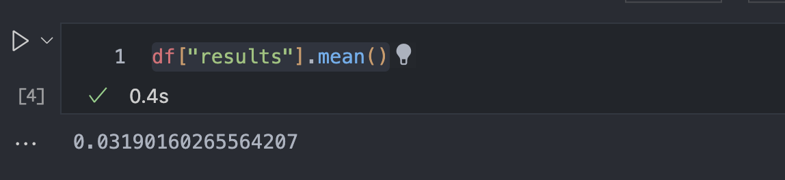

Author: Henry Greenhut
---
Lichess, a free, open source, online chess platform, [publishes](https://database.lichess.org/) each month a database of every game played on their website. I chose a dataset of over 10 million chess games from January of 2017. Using Pandas and Seaborn, I will explore the relationships between the openings played, the ratings of the players, and the results of the games.

**PART 1: PGN -> CSV**
Lichess stores the games in their database as a PGN (portable game notation). PGN files are formatted like this: 

```
[Event "F/S Return Match"]
[Site "Belgrade, Serbia JUG"]
[Date "1992.11.04"]
[Round "29"]
[White "Fischer, Robert J."]
[Black "Spassky, Boris V."]
[Result "1/2-1/2"]

1. e4 e5 2. Nf3 Nc6 3. Bb5 a6 4. Ba4 Nf6 5. O-O Be7 6. Re1 b5 7. Bb3 d6 8. c3 O-O 9. h3 Nb8 10. d4 Nbd7
11. c4 c6 12. cxb5 axb5 13. Nc3 Bb7 14. Bg5 b4 15. Nb1 h6 16. Bh4 c5 17. dxe5
Nxe4 18. Bxe7 Qxe7 19. exd6 Qf6 20. Nbd2 Nxd6 21. Nc4 Nxc4 22. Bxc4 Nb6
23. Ne5 Rae8 24. Bxf7+ Rxf7 25. Nxf7 Rxe1+ 26. Qxe1 Kxf7 27. Qe3 Qg5 28. Qxg5
hxg5 29. b3 Ke6 30. a3 Kd6 31. axb4 cxb4 32. Ra5 Nd5 33. f3 Bc8 34. Kf2 Bf5
35. Ra7 g6 36. Ra6+ Kc5 37. Ke1 Nf4 38. g3 Nxh3 39. Kd2 Kb5 40. Rd6 Kc5 41. Ra6
Nf2 42. g4 Bd3 43. Re6 1/2-1/2
```
I created a python script to convert this pgn to a csv. First, I divide the database into its multiple games. I delete the first one because that's everything before the first "[Event", which is not a game.
```python
with open('datasets/lichess_db_standard_rated_2017-01.pgn', 'r') as f:
    data = f.read()
games = data.split("[Event")
del games[0]
```

Next, I built a function to extract the different properties of the game. It takes two substrings as parameters. It finds the index of the first substring, and then finds the first index of the second substring that's after the index of the first substring:

```python
def find(game, sub1, sub2):
    idx1 = game.index(sub1)
    idx2 = game.find(sub2,idx1+1)
    substring = ""
    for idx in range(idx1 + len(sub1) + 1, idx2):
        substring = substring + i[idx]
    return substring
```

Then, I looped through all of the games and extracted each property:
```python
# Finding white's name
    sub1 = "[White "
    sub2 = "\"]"
    white_name = find(i, sub1, sub2)
    white_names.append(white_name)
```

This works for all of the properties I needed except for the moves, which aren't easily accessible. "1." doesn't work as the first substring because it can appear in the date. So, I used the double empty lines as the substrings, and extracted two characters ahead of the first substring:

```python
    sub1 = "\n\n"
    sub2 = "\n\n"
    idx1 = i.index(sub1)
    idx2 = i.find(sub2,idx1+1)
    moves = ""
    for idx in range(idx1 + len(sub1) + 3, idx2):
        moves = moves + i[idx]
    all_moves.append(moves)
```

Finally, once I had created lists for all of the properties, I added them as columns to a dataframe, and converted that dataframe into a csv:


```python
df = pd.DataFrame()
df["white_name"] = white_names
# ..all of the other properties...
df["moves"] = all_moves
df.to_csv("lichess_database_2017-01.csv")
```

**PART 2: Cleaning the dataset**

I opened my newly created csv file as a dataframe.

The results of the games (as in, whether white won, black won, or it was a draw) are stored with hyphens and fractions, which aren't easy to work with. I replaced these values with the numbers -1, 0, and 1:
```python
df['results'].replace(['1-0', '1/2-1/2', '0-1'],
                        [1, 0, -1], inplace=True)
```
There were a few "unterminated" and "abandoned" games that I was not interested in:
```python
df = df.loc[(df["results"] == 1) | (df["results"] == -1) | (df["results"] == 0)]
df = df[df["termination"] != "Abandoned"]
```

As expected, white tends to win more often than black:


**PART 3: Popular Opening Variations**

I'm interested in the success rate of popular openings. First, I found the five most popular openings: 

```python
openings = df['opening'].value_counts()[:5].index.tolist()
```
Then, I created a new dataframe with only games that followed one of these openings:
```python
popular_openings = df.loc[df['opening'].isin(openings)]
```

Now, I want to find to be able to find the win percentage of any opening. I created a method that takes a dataframe and an opening and returns the win percentage of that opening from the games in that dataframe. First, it creates a new dataframe with only games that followed the selected opening. Then it divides the number of games white wins with that opening by the number of games that ended in either white or black winning. shape[0] gives the number of rows.

```python
def win(df, opening):
    relevant = df[df["opening"] == opening]
    return relevant[df["results"] == 1].shape[0]/relevant[df["results"] != 0].shape[0]
```

Then, I passed each of the five most common opening variation through this function, and created a new dataframe with the openings in one column and their win percentage in the other. I used .unique() to run each opening through the function only once.

```python
opening_col = []
percent_col = []
for i in popular_openings["opening"].unique():
    opening_col.append(i)
    percent_col.append(win(popular_openings, i)*100)

opening_percent = pd.DataFrame()
opening_percent["opening"] = opening_col
opening_percent["percent"] = percent_col
```


Now I can display this table as a barplot. I imported matplotlib to be able to rotate the axis so the long opening names were visible, to zoom in onto the relevant portion of the y-axis, and to display the percentage values on the chart.

```python
import matplotlib as plt
o = sns.barplot(data=opening_percent, x="opening", y="percent")
o.set_xticklabels(labels = o.get_xticklabels(), rotation = 50)
o.set_ylim(40, 60)
for i in o.containers:
    o.bar_label(i,)
o
```

{:class="img-responsive"}

Fascinatingly, three of the top five most played openings fare better for the person playing with the black pieces; the Sicilian in particular is lethal. 

This chart is interesting, but anyone that plays chess will know that the Horwitz Defense isn't one of the most played openings. This happened because chess openings have dozens of variations, and each variation is being counted as its own opening. So, openings like the Horwitz Defense that don't have a lot of named variations are higher on the list.

**PART 4: Popular Opening Moves**

I'm interested in seeing the success rates of the most popular opening moves. To do this, I have to simplify each long opening varation into its general opening. I built a function that takes an opening as the parameter and strips it to only what's behind the ":", "#", or "," to leave just the initial phrase.

```python
def strip_opening(opening):
    final = ""
    if ":" in opening:
        final = opening.split(":")[0]
    elif "#" in opening:
        final = opening.split(" #")[0]
    elif "," in opening:
        final = opening.split(",")[0]
    else:
        final = opening
    return final
```

Then, I copied the dataframe and applied the function to the openings column:

```python
short_openings = df
short_openings["opening"] = df["opening"].apply(strip_opening)
```

Now that the openings are formatted the way I want, I can find the top five most popular opening moves and plot them against their win percentage the same way that I did before. This leaves us with this graph:


The Sicilian Defense is still strikingly effective for black, although interestingly, including all of its variations decreased black's win rate. The Scandinavian Defense remains a powerful option, although the Queen's Pawn Game comes out on top.

**PART 4: The Best and the Worst**

I found the win rates for the most popular openings, but which openings are the best? I ran every shortened opening through my win percentage function by looping through short_openings["opening"].unique() and created a new dataframe with the win percentage of every opening.

Then, I can sort the rows by their win percentage:


A few rows stand out -- particularly the openings with a 0 win percentage. I had to investigate further. Out of millions of chess games, how did nobody win with the Amar Gambit? I discovered that in January of 2017, the Amar gambit was played exactly once, by the daring "supersebi7" against someone rated nearly 300 elo higher than them. They lost horribly, and for good reason. It's an atrocious opening. Please enjoy the gif I generated of their game: 


If there is one takeaway from this dataset, it is to not play the Amar gambit. The sample size is small, but this game speaks for itself.

At the top of the dataframe sits the Lemming Defense, with a stunning 71% win rate. I'm curious about how different rating ranges do with the Lemming Defense.

**PART 5: Rating Ranges**

First, I created a dataframe of only games that followed the Lemming Defense

```python
lemming = short_openings[short_openings["opening"] == "Lemming Defense"]
```

The rating, or "elo" as it is known in chess, of the players will be different for the person playing with black than the person playing with white. So, I created a new column in the dataframe that was the average of these two ratings:

```python
lemming["average-rating"] = (lemming["white_elo"] + lemming["black_elo"])/2
```

Using .max(), .min(), and .mean(), I found that the highest average rating was 2525, the lowest was 836, and the average was around 1400.

I created five rating categories and divided the dataframe of lemming openings into five dataframes by filtering for the rating range designated for each category:

```python
lemming_1000 = lemming[lemming["average-rating"].between(600, 1000)]
```

And then, similarly to the opening analysis before, I ran each dataframe through the "win" function I built earlier and stored the returned percent in a "percent column" list. Then, I created a new dataframe with that percent column and a "rating category" column:


Finally, I plotted this table on a barplot, with the rating category on the x-axis and the percentages on the y-axis.


And we can see that the Lemming Defense thrives until the players reach around 1800 elo. At the highest level, it is usually unsuccessful for white -- but at least still better than the Amar Gambit.

**Sources used**

* substring between two substrings: [https://www.geeksforgeeks.org/python-extract-string-between-two-substrings/](https://www.geeksforgeeks.org/python-extract-string-between-two-substrings/)
* second instance of substring: [https://www.naukri.com/learning/articles/how-to-find-second-occurence-of-sub-string-in-python-string/](https://www.naukri.com/learning/articles/how-to-find-second-occurence-of-sub-string-in-python-string/)
* get most frequent values of column: [https://stackoverflow.com/questions/48590268/pandas-get-the-most-frequent-values-of-a-column](https://stackoverflow.com/questions/48590268/pandas-get-the-most-frequent-values-of-a-column)
* change axis limits on plots: [https://www.geeksforgeeks.org/how-to-change-axes-limits-in-seaborn/](https://www.geeksforgeeks.org/how-to-change-axes-limits-in-seaborn/)
* display values on plots: [https://www.geeksforgeeks.org/how-to-show-values-on-seaborn-barplot/](https://www.geeksforgeeks.org/how-to-show-values-on-seaborn-barplot/)
* apply function to entire dataframe column: [https://pandas.pydata.org/docs/reference/api/pandas.Series.apply.html](https://pandas.pydata.org/docs/reference/api/pandas.Series.apply.html)
