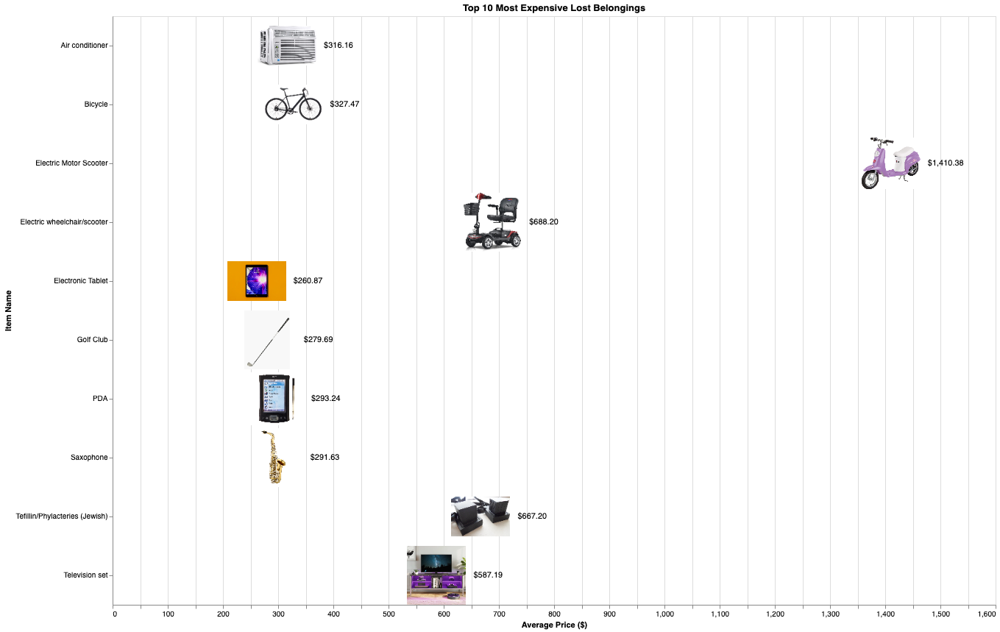

It was another cold, hazy Friday morning in 2017. My wallet was packed deep in my right pocket, filled with $1 bills in eager preparation for the bake sale later in the day. I boarded the 1 train, finding a seat in the back of the car. I stood as the train screeched to a halt at 110, swiftly moving toward the doors. As the doors closed behind me, I felt for my wallet. Nothing.

I've taken the uptown 1 train every school morning for the past 12 years. I've ridden in the same cars so many times, that I've on multiple occations recognized a crack in the paint or a sticker on the wall from a previous ride. So many times, that I wouldn't have known how to calculate it when I had first started. Multiplying the 160 days of school by the 12 years of school I've gone through, and then adding in the numerous other times I've ridden the subway, I've been on the 1 train around 2,000 times.

My wallet isn't the only item I've lost to the jaws of the New York City subway. In fact, I lost my third metrocard last week. And I'm not alone:

Underneath Penn Station lies the MTA's lost and found. Items found on public transportation by MTA employees or good samaritans are sent there to await a claim. For years, the MTA maintained a public, online database of the items stored in the lost and found. As of 2018, there were 751,622 items, but after 2018, they stopped updating the live database. Here's a snapshot of dataset, with some of the more peculiar items.

| count | group              | item                |
|-------|--------------------|---------------------|
| 791   | Tickets            | Lottery Tickets     |
| 687   | Book               | Diary               |
| 98    | Musical Instrument | Clarinet            |
| 2     | Electronics        | Air conditioner     |
| 27    | Identification     | Death Certificate   |

I'm not the first data scientists to interest themselves in the dropped wallets of unknown New Yorkers. Check out this great article by fivethirtyeight.com (https://fivethirtyeight.com/features/mta-new-york-lost-and-found-subway-most-common/).

It's worth noting that there are some peculiarities for this dataset. On their developer portal (http://web.mta.info/developers/developer-data-terms.html#data), the mta claims that the Lost and Found data is refreshed every hour, but it's not even available online anymore --> I had to track down an old snapshot of it. Also, while fivethirtyeight claims that the dataset is consistently updated when the article was published in 2014, this post investigating the data shows that the data stopped updating sometime before or during 2018 

It's also unclear when the MTA started their lost and found program. Their online claim system started in 2009, so they must have started collecting items sometime between 2009 and when the MTA began operating in 1965. 

What kind of stuff do people lose? Everything. The MTA sorts the lost items into a range of categories, from Musical Instruments to Footwear.

With hundreds of thousands of items left without a home, I wondered, how much was it all worth? How much does the thoughtlessness of the patrons of the New York City subway system cost us each year? But I don't want to spend time estimating the value of the 9 harmonicas or the 168 walkie talkies abandoned to the clutches of the MTA. I'd rather amazon do it for me.

I scraped Amazon with the item names and then collected the prices of the search results. Then, I took the 10 middle values to avoid any outliers. With those values, we can estimate an average price for each item. Here are the top 10 most expensive items, according to Amazon:

I can't say I have any pity for the 2 people that left an Electric Motor Scooter behind.


30for30 - 168,478 items in 2014

new york times - 8,000 per year

video says 30,000 items each year, 18% go back to owners
calculate # of times i've taken the 1 train

and through all of those bleary mornings, i've also had some belongings fall victim. A wallet and 3 metrocards.

And I'm not alone, 
show top 10 graph

show categories, identification first, even death certificates

new yorkers do care for their expensive stuff, which make sense, but that does not explain the 13 lost saxophones