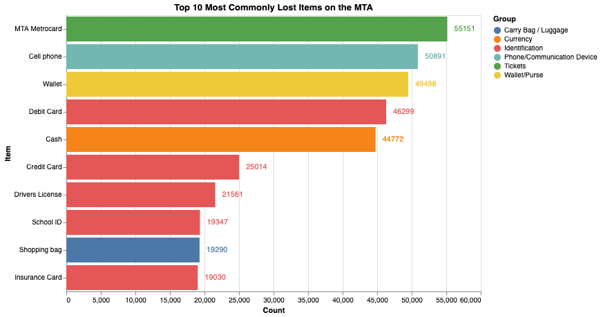
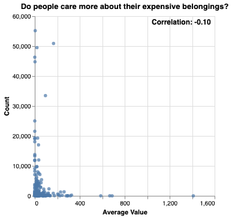

It was another cold, hazy Friday morning in 2017. My wallet was packed deep in my right pocket, filled with $1 bills in eager preparation for the bake sale later in the day. I boarded the 1 train, finding a seat in the back of the car. I stood as the train screeched to a halt at 110th street, swiftly moving toward the doors. As the doors closed behind me, I felt for my wallet. Nothing.

I've taken the uptown 1 train every school morning for the past 12 years. I've ridden in the same cars so many times, that I've on multiple occations recognized a crack in the paint or a sticker on the wall from a previous ride. Multiplying the 160 days of school by the 12 years of school I've gone through, added with some extra for the numerous other times I've ridden the subway, I've been on the 1 train around 2,000 times.

My wallet isn't the only item I've lost to the jaws of the New York City subway. In fact, I lost my third metrocard last week. And I'm not alone:

Underneath Penn Station lies the MTA's lost and found. Items found on public transportation by MTA employees or good samaritans are sent there to await a claim. For years, the MTA maintained a public, online database of the items stored in the lost and found. What kind of stuff do people lose? How much is it all worth? If I sold it all, could I buy a train? Should I drop out of school and pursue a more meaningful career path: selling items I find on the subway? These are all questions I sought to answer.

For now, here's a snapshot of the MTA dataset from 2018, with some of the more peculiar items.

| count | group              | item                |
|-------|--------------------|---------------------|
| 791   | Tickets            | Lottery Tickets     |
| 687   | Book               | Diary               |
| 98    | Musical Instrument | Clarinet            |
| 2     | Electronics        | Air conditioner     |
| 27    | Identification     | Death Certificate   |

As of 2018, there were 751,622 items, but after 2018, they stopped updating the live database.

I'm not the first data scientist to interest themselves in the dropped wallets of unknown New Yorkers. Check out this [great article](https://fivethirtyeight.com/features/mta-new-york-lost-and-found-subway-most-common/) by fivethirtyeight.com.

It's worth noting that there are some peculiarities for this dataset. On their [developer portal](http://web.mta.info/developers/developer-data-terms.html#data), the MTA claims that the lost and found data is refreshed every hour, but it's not even available online anymore -- I had to track down an old snapshot of it. Also, while fivethirtyeight claims that the dataset is consistently updated when the article was published in 2014, [this github post](https://github.com/jsoma/data-studio-projects/issues/176) investigating the data indicates that the data stopped updating sometime before or during 2018 

It's also unclear when the MTA started their lost and found program. Their online claim system started in 2009, so they must have started collecting items sometime between 2009 and when the MTA began operating in 1965. 

New Yorkers leave behind all kinds of items on the train. The MTA sorts the lost items into a range of categories, from Musical Instruments to Footwear.

With hundreds of thousands of items left without a home, I wondered, how much was it all worth? How much does the thoughtlessness of the patrons of the New York City subway system cost them each year? But I don't want to spend time estimating the value of the 9 harmonicas or the 168 walkie talkies abandoned to the clutches of the MTA. I'd rather Amazon do it for me.

I scraped Amazon with the item names within each corresponding Amazon category and then collected the prices of the search results. Then, I took the 10 middle values to avoid any outliers. With those values, we can estimate an average price for each item. Here are the top 10 most expensive items, according to Amazon (fully interactive, hover over each image to see how many there are!):



Amazon gives a good estimation on the prices of similar items, but its obviously impossible to accurately guage exactly how much each item is worth. The quality, quantity, and age of each item could vastly change its current worth.

It makes sense logically that there are less electric motor scooters, than bicycles, and less bicycles left behind than metrocards. Common sense tells us that New Yorkers are more careful with their more expensive belongings (and bring less of them onto the train than they bring cheaper items.) But is that true?

I wouldn't dare attempt to draw a line of best fit, but the graph does suggest a slight correlation that cheaper items are lost more, even though one of the most expensive items, phones, are left behind very often.

Now we've arrived at the real question: how much is it all worth? Calculating it isn't so simple. First of all, it's hard to judge a market price of a death certificate. I overided the price Amazon assigned each item in the "identification" category to be worthless. Secondly, each category has an "other" item, like "All other Electronics". Instead of whatever value the Amazon scrape assigned it, I'll calculate that item's average price as the average of the average prices of the other items in the same category. And finally, these items aren't going to be worth the same as a new item bought off of Amazon. After a quick investigative foray into the world of investing and reselling, I'm going to roughly estimate that we could resell these items for half of what Amazon would sell them for.

And so, by halving all of the average prices, and then multiplying each with the count of the corresponding item, we reach our final figure...

**$11,081,085.60**

That's a pretty impressive number, but can I buy a train with it? It's difficult to judge how expensive a New York City subway is, as they're not exactly on the market. But according to [MTA's budget report from 2013](http://web.mta.info/mta/budget/pdf/2008-2013%20Capital%20Plan.pdf), they spent $1.25 billion on 620 new R160 cars. That's around 2 million per car. A typical NYC Subway consists of 8-11 cars. We can buy 5 -- about half of a subway. Extremely disappointing.