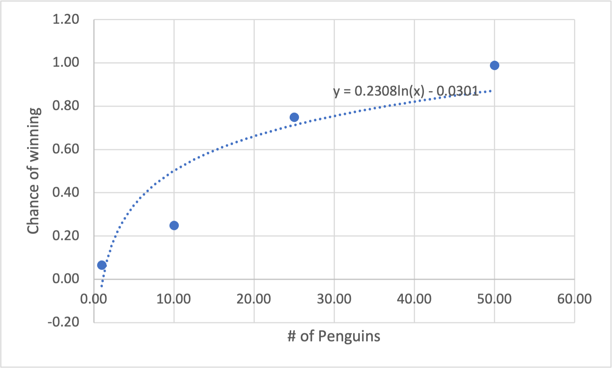
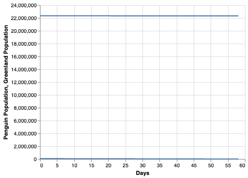
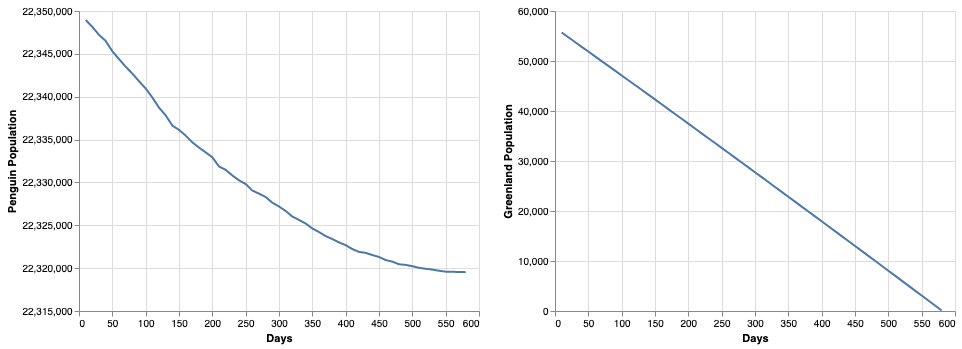
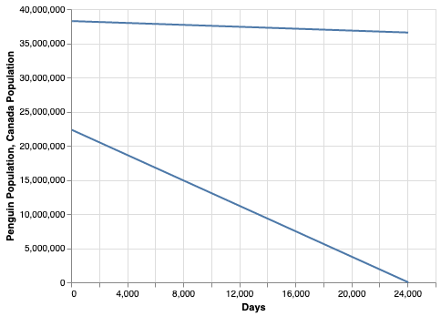

Author: Henry Greenhut
---

Tired of being the victim of data analysis problems, the Penguins decide there is only one thing to do: seige humanity.

Penguins aren't historically the most dangerous of creatures. In fact, throughout human history, there have been precisely [0 recorded cases](https://animalvivid.com/do-penguins-attack-humans/) of a human being killed by a penguin. That doesn't mean it can't happen though.

They may not have a taste for humans, but they have sharp, hooked beaks and a mean glare. So, it's easy to image that if they attacked in a horde, they could overwhelm a human.

But how many of them would it take? Sticking only to the most scientific methods, I asked my Art of Data class. Please absorb the following table of the percent chance of a given number of penguins winning a fight against a human:

| # of Penguins | Chance of Winning |
|---------------|-------------------|
| 1             | 7%                |
| 10            | 25%               |
| 25            | 75%               |
| 50            | 99%               |

By graphing these numbers, we can derive an equation of the line of best fit to determine how the chance of the penguins winning grows for each additional penguin.

So strength in numbers clearly is important. But how many penguins do we have? Observe the following table:

| Species             | Population  |
|---------------------|-------------|
| Macaroni            | 12,600,000  |
| Chinstrap           | 8,000,000   |
| Adelie              | 7,580,000   |
| Magellanic          | 3,200,000   |
| Southern Rockhopper | 2,500,000   |
| Royal               | 1,700,000   |
| Gentoo              | 774000      |
| Emperor             | 595000      |
| Northern Rockhopper | 480600      |
| Little Penguin      | 469760      |
| Erect-Crested       | 150000      |
| Snares              | 63000       |
| African             | 50000       |
| Humboldt            | 32000       |
| Yellow-Eyed         | 2,528-3,480 |
| Fiordland           | 2,500-9,999 |

But of the 18 species of Penguins, only 4 of them live in colder climates (Emperors, Gentoos, Chinstraps, and Adélies) while the rest live in warmer climates.

[Source 1](https://247wallst.com/special-report/2019/04/23/how-many-penguins-are-in-existence-2/)
[Source 2](https://theconversation.com/curious-kids-how-can-penguins-stay-warm-in-the-freezing-cold-waters-of-antarctica-116831#:~:text=There%20are%20four%20species%20of,gentoos%2C%20chinstraps%2C%20and%20Ad%C3%A9lies.&text=All%20these%20penguins%20have%20special,extreme%20birds%20in%20the%20world.)

This climate disparity will make it difficult for all the penguins to work together. Thinking realisticially, the penguins would split into 2 groups: the colder climate penguins, and the warmer climate penguins. Let's focus on the colder climate penguins first.

After converging at their home base in Antartica, the Cold Penguins look toward Greenland as an obvious target. I ran a simulation to predict how Greenland's pitiful population of 56,653 compared to the mighty 22,349,760 invading penguins.

The simulation works like this: Until either the population of Greenland or the penguins reach 0, I find the number of penguins per human, and then take a random number of penguins between 1 and that number of penguins per human. Then, using the equation y = 0.2303ln(x) + 0.0301, I calculate that number of penguins' chance of winning. Then, with a random number generator, I can pick a random number between 0 and 1. If the number is within the penguin's chance of winning, the human dies. If it's not, the number of penguins on the attack dies. This process continues until either all of the penguins or all of the people are dead.

Unsurprising, with the overwhelming numbers advantage, the penguins easily win.

In fact, on the same axis, there's such a massive difference in orders of magnitude that its difficult to understand what happened. Putting the graphs side by side helps with this.

30229 penguins and 56653 Greenlanders died.

Roused by their glorious victory, the Penguins forge onward into Canada.

Its a long and hard fight, but The 38,250,000 Canadians obliterate the remaining 22,319,531 penguins. 1,860,885 Canadians gave up their lives for their country, but the Penguins have been defeated. Can the warm climate penguins avenge their fallen comrades? Only time will tell.